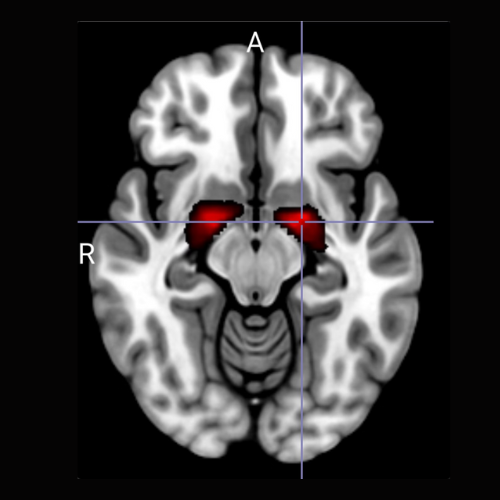

<p align="center">
  
</p>

<h1 align="center">PD-MCI Ch4 Subtyping Tool</h1>

<p align="center">
  <strong>MRI-based cholinergic subtyping of Parkinson's disease with mild cognitive impairment</strong>
</p>

<p align="center">
  <a href="https://ch4subtyping.negida.com"></a>
  <a href="https://negidamd.github.io/ch4-subtyper/"></a>
</p>

<p align="center">
  <a href="https://doi.org/10.1016/j.parkreldis.2025.108072"></a>
  <a href="https://pubmed.ncbi.nlm.nih.gov/41106089/"></a>
  <a href="https://pmc.ncbi.nlm.nih.gov/articles/PMC12949478/"></a>
</p>

---

## Background

Parkinson's disease with mild cognitive impairment (PD-MCI) is clinically heterogeneous. Identifying pathologically distinct subtypes could improve clinical trial design and enable precision therapeutics. The **cholinergic nucleus 4 (Ch4)**, located in the nucleus basalis of Meynert (NBM), is selectively vulnerable to alpha-synuclein pathology in PD, and its degeneration has been robustly linked to cognitive decline, neuropsychiatric symptoms, and faster disease progression.

This tool implements a **normative regression-based subtyping framework** that classifies PD-MCI patients as having **Low Ch4 GMD** (disproportionate cholinergic degeneration) or **Normal Ch4 GMD** based on structural MRI, adjusting for age, sex, and total intracranial volume.

## Key Findings

| Finding | Detail |
|---------|--------|
| **Distinct clinical profile** | PD-MCI patients with Low Ch4 GMD have significantly worse motor scores (MDS-UPDRS), autonomic dysfunction, and olfactory impairment |
| **Faster cognitive decline** | Low Ch4 GMD subgroup progresses faster to cognitive milestones (log-rank P = 0.0017) |
| **Overlap with diffuse malignant PD** | 51.6% of Low Ch4 GMD patients classified as diffuse malignant vs. 23.4% in Normal Ch4 GMD |
| **Outperforms existing subtypes** | Ch4 subtyping outperformed tremor-dominant/PIGD, brain-first/body-first, and diffuse-malignant classifications in predicting cognitive deterioration |

## Publications & Presentations

### Peer-Reviewed Article

> **Negida A**, Vohra HZ, Lageman SK, Mukhopadhyay N, Berman BD, Weintraub D, Barrett MJ. Parkinson's disease mild cognitive impairment with MRI evidence of cholinergic nucleus 4 degeneration: A new subtype? *Parkinsonism & Related Disorders*. 2025;141:108072.
>
> [Full Text](https://www.prd-journal.com/article/S1353-8020(25)00813-2/abstract) &bull; [PubMed](https://pubmed.ncbi.nlm.nih.gov/41106089/) &bull; [DOI: 10.1016/j.parkreldis.2025.108072](https://doi.org/10.1016/j.parkreldis.2025.108072)

### Conference Presentations

| Event | Type | Year |
|-------|------|------|
| **American Academy of Neurology (AAN) Annual Meeting** | Oral Presentation (S32.005) | 2025 |
| **International Congress of Parkinson's Disease and Movement Disorders (MDS)** | Poster Presentation | 2024 |

- **AAN 2025 Abstract:** [Neurology 2025;104(7 Supplement 1)](https://www.neurology.org/doi/10.1212/WNL.0000000000212426)
- **MDS 2024 Abstract:** [MDS Abstracts](https://www.mdsabstracts.org/abstract/subtyping-parkinsons-disease-mild-cognitive-impairment-pd-mci-by-cholinergic-degeneration/)

### Media Coverage

- **Neurology Today** (American Academy of Neurology): [Coverage of AAN 2025 findings](https://neurologytoday.aan.com/doi/10.1212/breakingnews.1581)

---

## How the Tool Works

### Inputs

| Parameter | Description | Units |
|-----------|-------------|-------|
| **Standardized Ch4 GMD** | Gray matter density of the Ch4 region extracted from T1-weighted MRI using the cytoarchitectonic maps of Zaborszky et al. | 0-1 (probability) |
| **Age at MRI** | Patient age at time of MRI acquisition | Years |
| **Sex** | Biological sex | Male / Female |
| **Total Intracranial Volume (TIV)** | Total intracranial volume from segmentation | mL (supports mm&sup3;, L, or custom) |

### Computation

**Step 1 &mdash; Scaling.** The standardized Ch4 GMD is transformed using healthy control reference values (mean = 0.399, SD = 0.039):

```
Scaled Ch4 GMD = ((Ch4_std - 0.3985) / 0.0387) * 3 + 10
```

**Step 2 &mdash; Normative Prediction.** A predicted value is computed from a multiple linear regression model derived from healthy controls:

```
Predicted = 1.579 + (-0.108 * Age) + (0.865 * Sex) + (0.010 * TIV_mL)
```

where Sex is coded as Male = 1, Female = 0.

**Step 3 &mdash; Z-score & Classification.** The deviation is expressed as a z-score (SD<sub>residual</sub> = 2.225):

```
Z = (Scaled_Ch4_GMD - Predicted) / 2.225
```

Patients with **z < -1.0** are classified as **Low Ch4 GMD**.

### Outputs

| Output | Description |
|--------|-------------|
| **Scaled Ch4 GMD** | Participant's Ch4 GMD on the common scale |
| **Predicted Value** | Expected Ch4 GMD for age, sex, and TIV |
| **Z-score** | Standardized deviation from the normative prediction |
| **Classification** | **Low Ch4 GMD** (z < -1.0) or **Normal Ch4 GMD** (z &ge; -1.0) |

### Ch4 GMD Extraction

Ch4 GMD should be extracted from T1-weighted MRI using the stereotactic cytoarchitectonic maps of [Zaborszky et al. (2008)](https://doi.org/10.1016/j.neuroimage.2007.09.024) via established VBM pipelines (e.g., CAT12/SPM). The input value is the mean gray matter density within the Ch4 (NBM) region of interest.

---

## Disclaimer

This tool is intended as a **research decision-support aid** and is not designed for standalone clinical diagnosis or treatment decisions. Results should be interpreted by qualified investigators in the context of validated imaging protocols and the full clinical picture.

## Citation

If you use this tool in your research, please cite:

```bibtex
@article{Negida2025Ch4,
  title     = {Parkinson's disease mild cognitive impairment with MRI evidence of
               cholinergic nucleus 4 degeneration: A new subtype?},
  author    = {Negida, Ahmed and Vohra, Hiba Z. and Lageman, Sarah K. and
               Mukhopadhyay, Nitai and Berman, Brian D. and Weintraub, Daniel
               and Barrett, Matthew J.},
  journal   = {Parkinsonism \& Related Disorders},
  volume    = {141},
  pages     = {108072},
  year      = {2025},
  doi       = {10.1016/j.parkreldis.2025.108072},
  pmid      = {41106089}
}
```

## Authors

**Ahmed Negida, MD, PhD** (Corresponding Author)
Department of Neurology, Virginia Commonwealth University, Richmond, VA
[ahmed.negida@vcuhealth.org](mailto:ahmed.negida@vcuhealth.org)

Hiba Z. Vohra &bull; Sarah K. Lageman, PhD &bull; Nitai Mukhopadhyay, PhD &bull; Brian D. Berman, MD, MS &bull; Daniel Weintraub, MD &bull; Matthew J. Barrett, MD, MSc

## Tech Stack

Built with [React](https://react.dev/) + [TypeScript](https://www.typescriptlang.org/) &bull; [Vite](https://vitejs.dev/) &bull; [shadcn/ui](https://ui.shadcn.com/) &bull; [Tailwind CSS](https://tailwindcss.com/)

## Development

```sh
# Install dependencies
npm install

# Start development server
npm run dev

# Build for production
npm run build
```

## License

All rights reserved. For research use only.
